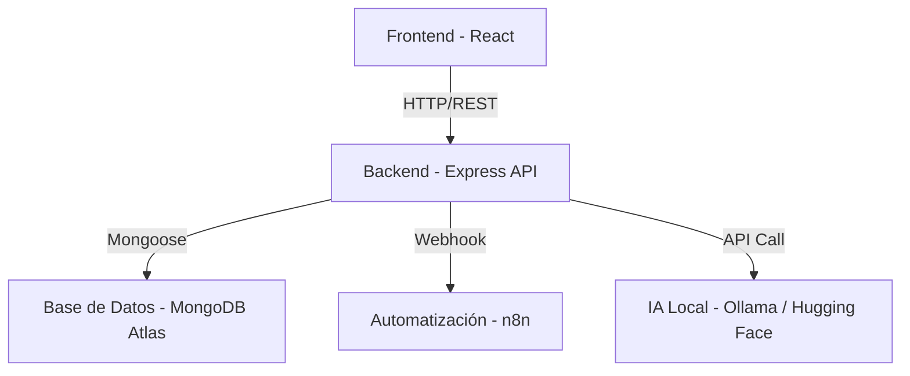

# 🎓 TPTUTOR - Virtual Critical Reading Tutor

**TPTUTOR** es una aplicación web Full-Stack (MERN) diseñada para actuar como un tutor virtual de lectura crítica. El sistema utiliza Inteligencia Artificial para generar preguntas, detectar sesgos y ofrecer retroalimentación personalizada, apoyando tanto a estudiantes como a docentes en el proceso educativo.

---

## 🚀 Descripción General

El proyecto tiene como finalidad promover la comprensión lectora, el razonamiento y la argumentación lógica.

**Funcionalidades Principales:**
- **Generación automática de preguntas** sobre textos cargados (PDF/Texto).
- **Detección de sesgos y falacias** utilizando IA (Modelos LLM locales).
- **Automatización de flujos** (correos, recordatorios, registro) mediante n8n.
- **Feedback inmediato** para estudiantes y estadísticas para docentes.

---

## 🛠️ Stack Tecnológico & Arquitectura

El sistema sigue una arquitectura **MERN** moderna, modular y contenerizada.

### Backend
- **Runtime:** Node.js
- **Framework:** Express.js (REST API)
- **Base de Datos:** MongoDB Atlas (Mongoose ODM)
- **IA:** @huggingface/inference + Ollama (Local LLM)
- **Testing:** Jest + Supertest

### Frontend
- **Framework:** React 19 + Vite
- **Estilos:** TailwindCSS
- **Routing:** React Router DOM
- **Testing:** React Testing Library + Cypress (E2E)

### DevOps & Automatización
- **Contenerización:** Docker + Docker Compose
- **Automatización:** n8n (Workflow Automation)

### Diagrama de Arquitectura

⚠️ Requisitos Previos Externos (CRÍTICO)
Para el correcto funcionamiento del sistema (especialmente en modo Docker), debes tener instalados y ejecutándose manualmente los siguientes servicios en tu máquina local (Host):

1. Ollama (Inteligencia Artificial)
El backend espera comunicarse con Ollama en el puerto 11434.

Descarga e instala Ollama.

Descarga el modelo gemma:2b (utilizado por defecto):

Bash

ollama pull gemma:2b
Asegúrate de que Ollama esté corriendo:

Bash

ollama serve
2. n8n (Automatización)
El sistema envía webhooks a n8n.

Instala y ejecuta n8n localmente (o en su propio contenedor fuera de este stack).

Debe estar accesible en el puerto 5678.

Configura el webhook de lectura completada en: http://localhost:5678/webhook/tptutor/reading-completed

🔧 Configuración e Instalación
1. Variables de Entorno
Crea un archivo .env dentro de la carpeta /backend con la siguiente estructura (ejemplo):

Fragmento de código

PORT=5000
MONGO_URI=tu_string_de_conexion_atlas
JWT_SECRET=tu_secreto_seguro
# La URL de Ollama y n8n se configuran automáticamente en docker-compose para apuntar al host
2. Ejecución con Docker (Recomendado)
Este proyecto está configurado para levantar el Frontend y Backend en contenedores, conectándose a tu MongoDB Atlas y a tus servicios locales (Ollama/n8n) a través del gateway del host.

Bash

# Construir y levantar los contenedores
docker-compose up --build
Frontend: Accesible en http://localhost:5173

Backend: Accesible en http://localhost:5000

3. Ejecución Manual (Desarrollo sin Docker)
Backend:

Bash

cd backend
npm install
npm run dev
Frontend:

Bash

cd frontend
npm install
npm run dev
🧪 Testing y QA
La calidad del código está asegurada mediante pruebas unitarias, de integración y E2E.

Backend (Jest)
Ejecuta las pruebas unitarias y de integración para la API:

Bash

cd backend
npm test
# Para ver cobertura:
# npm run test -- --coverage
Frontend (Jest + RTL)
Ejecuta las pruebas unitarias de componentes React:

Bash

cd frontend
npm test
End-to-End (Cypress)
Pruebas de flujo completo simulando al usuario real. Asegúrate de que el servidor frontend (http://localhost:5173) esté corriendo.

Bash

cd frontend
# Abrir interfaz interactiva
npm run test:e2e:open

# Ejecutar en modo headless (CI)
npm run test:e2e:run
📂 Estructura del Proyecto
Plaintext

/
├── backend/            # API Express & Lógica de negocio
│   ├── src/
│   │   ├── controllers/
│   │   ├── models/
│   │   ├── routes/
│   │   └── services/   # Integraciones con IA y PDF
│   ├── tests/          # Tests de Jest
│   └── Dockerfile
├── frontend/           # SPA React
│   ├── src/
│   │   ├── components/
│   │   ├── hooks/
│   │   └── pages/
│   ├── cypress/        # Tests E2E
│   └── Dockerfile
└── docker-compose.yml  # Orquestación de contenedores
🤝 Contribución
Fork del repositorio.

Crea una rama para tu feature (git checkout -b feature/AmazingFeature).

Realiza tus cambios (Asegúrate de pasar los tests: npm test).

Push a la rama (git push origin feature/AmazingFeature).

Abre un Pull Request.
