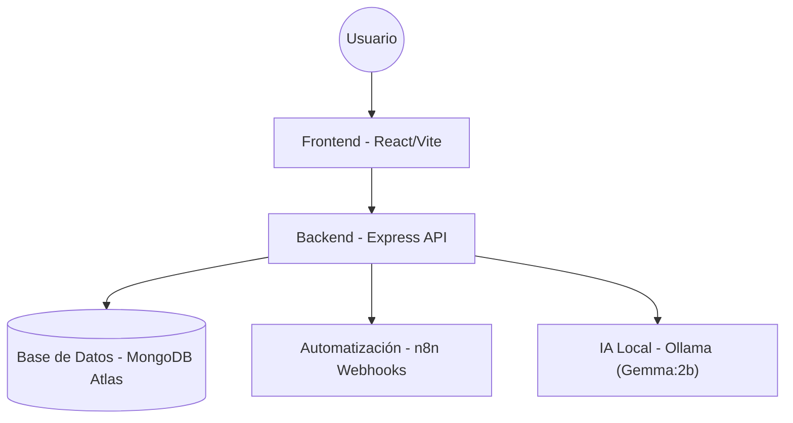

# TPTUTOR 🎓


**TPTUTOR** es una aplicación web full-stack que funciona como un **tutor virtual de lectura crítica**.

El sistema ayuda a estudiantes y docentes a desarrollar habilidades de pensamiento crítico mediante:
- 🤖 **Generación automática de preguntas** sobre textos utilizando IA.
- ⚖️ **Detección de sesgos y falacias** en los argumentos.
- ⚡ **Automatización de flujos** (recordatorios y notificaciones) con n8n.

---

## 📋 Tabla de Contenidos
1. [Descripción General](#descripción-general)
2. [Objetivos](#objetivos)
3. [Arquitectura](#arquitectura-del-sistema)
4. [Tecnologías](#tecnologías-principales)
5. [Pre-requisitos](#-pre-requisitos)
6. [Instalación y Configuración](#-instalación-y-configuración)
7. [Ejecución con Docker](#-ejecución-con-docker-recomendado)
8. [Ejecución Local (Manual)](#-ejecución-local-manual)
9. [Testing](#-testing)

---

## 📖 Descripción General

El proyecto **TPTUTOR** tiene como finalidad apoyar el proceso educativo promoviendo la comprensión, el razonamiento y la argumentación lógica.

Este sistema está orientado a:
* **Estudiantes:** Reciben retroalimentación inmediata y práctica personalizada.
* **Docentes:** Asignan textos, revisan estadísticas y generan reportes.

---

## 🎯 Objetivos

1.  Desarrollar un sistema **innovador y escalable** para la lectura crítica.
2.  Integrar **Inteligencia Artificial (Gemma:2b)** para el análisis de textos.
3.  Implementar **automatización** de tareas con n8n.
4.  Aplicar metodologías ágiles y buenas prácticas de ingeniería de software.

---

## 🏗 Arquitectura del Sistema

La arquitectura sigue el modelo **MERN** contenerizado:


## 🛠 Tecnologías Principales

| Área | Tecnologías |
| :--- | :--- |
| **Frontend** | React.js, Redux Toolkit, Vite, TailwindCSS (opcional) |
| **Backend** | Node.js, Express.js, JWT, Multer |
| **Base de Datos** | MongoDB Atlas (Mongoose) |
| **IA** | Ollama (Modelo: gemma:2b), Hugging Face Transformers |
| **DevOps** | Docker, Docker Compose |
| **Testing** | Jest, Supertest |

## ⚙️ Pre-requisitos

Antes de comenzar, asegúrate de tener instalado:

### 1. Docker Desktop
Debe incluir **Docker Compose**. Es esencial para la contenerización.

### 2. Node.js (v18+)
*Solo necesario si vas a correr el proyecto manualmente sin Docker.*

### 3. Ollama
Es el motor de Inteligencia Artificial local.
* Descarga Ollama desde [ollama.com](https://ollama.com).
* Ejecuta este comando en tu terminal:
    ```bash
    ollama pull gemma:2b
    ```
    > **Nota:** La IA corre en tu máquina local (Host) y Docker se conecta a ella.

### 4. Cuenta en MongoDB Atlas
Necesitarás crear un clúster gratuito para obtener tu **URI de conexión**.

---

## 🚀 Instalación y Configuración

### 1. Clonar el repositorio

```bash
git clone [https://github.com/tu-usuario/tptutor.git](https://github.com/tu-usuario/tptutor.git)
cd tptutor
```

### 2. Configurar Variables de Entorno (Backend)
Navega a la carpeta backend y crea un archivo .env copiando el siguiente contenido.

Importante: Asegúrate de reemplazar <usuario> y <password> con tus credenciales reales de Mongo Atlas.
    ```bash
    
    # Archivo: backend/.env
    PORT=5000
    
    # Conexión a Base de Datos (MongoDB Atlas)
    MONGO_URI=mongodb+srv://<usuario>:<password>@cluster.mongodb.net/tptutor_db
    
    # Seguridad
    JWT_SECRET=tu_palabra_secreta_super_segura
    
    # Configuración de IA (Apunta al Host desde Docker)
    OLLAMA_BASE_URL=[http://host.docker.internal:11434](http://host.docker.internal:11434)
    
    # Configuración de Automatización (Webhook de n8n)
    N8N_WEBHOOK_READING_COMPLETED=[http://host.docker.internal:5678/webhook/tptutor/reading-completed](http://host.docker.internal:5678/webhook/tptutor/reading-completed)
    ```

### 3. Configurar Variables de Entorno (Frontend)
Navega a la carpeta frontend y crea un archivo .env:

```bash
# Archivo: frontend/.env
VITE_API_TARGET=http://localhost:5000
```

## Ejecución con Docker (Recomendado)
Esta opción levanta toda la aplicación (Frontend + Backend) automáticamente y es la más estable.

### 1. Iniciar Ollama en tu PC
Asegúrate de que Ollama esté corriendo en segundo plano en tu sistema operativo (no en Docker).

### 2. Levantar contenedores
Ejecuta en la raíz del proyecto:

```bash

docker-compose up --build
3. Acceder a la aplicación
Frontend: http://localhost:5173

Backend API: http://localhost:5000
```

## Ejecución Local (Manual)
Si prefieres no usar Docker, puedes ejecutar cada parte por separado en terminales distintas.

### 1. Backend

```bash
cd backend
npm install
npm run dev
```
### 2. Frontend

```bash
cd frontend
npm install
npm run dev
```
## 🧪 Testing
El proyecto utiliza Jest para realizar pruebas unitarias y de integración en el servidor.

Ejecutar tests

```bash
cd backend
npm test
Esto generará un reporte de cobertura en la consola indicando qué módulos pasaron las pruebas.
```
